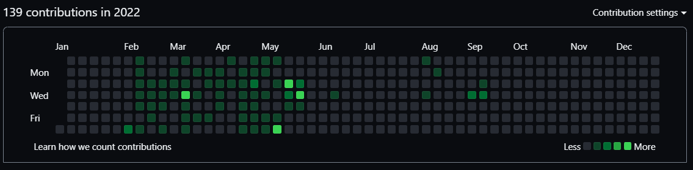

## 2년차를 시작하며

 
 
날짜를 보니 오늘로 딱 개발자가 된지 1년이 되는 날이었습니다.
주변에서 경력을 물어보면 한달 전쯤부터 약간 반올림해서 2년차(?)라고 우겼지만 오늘로 찐 2년차 개발자입니다.
1년동안 열심히 살았냐고 스스로에게 물어본다면, 글쎄요..🤣
 
사회초년생이다, 신입이라는 핑계를 6개월 정도 사용했고, 나머지 기간은 이직무새가 되어서 이력서만 열심히 쓰고 진짜 개발 공부에는 집중하지 못했습니다..
 
 
 

<small style="color:grey;text-decoration:line-through"> 텅텅비어버린 저의 깃 이력</small>

## 부트캠프를 수강한 계기
 
 
보다시피 취업 이후에 놔버린 개인 공부도 이유이긴 했지만 각종 회사에 면접과 이력서를 제출해 본 결과 무수한 서류 탈락을 경험했고 개발자로서 필요한 기본기에 구멍이 많이 뚫려있다고 생각하게 되었습니다.
 
당장 이직은 했지만 앞으로 cs지식이라던지, 코딩테스트는 경력 이직에 가장 큰 영향을 미칠 요인임에도 불구하고 공부에 강제성이 없으니 자꾸만 손놓게 되었습니다.
그리고 앞으로는 신입이라는 쉴드가 벗겨질 제 미래가 걱정되었습니다...
 
마침 제로베이스의 커리큘럼에 코딩테스트와 CS 관련 지식들이 포함되어 있어서 수강하기로 결심했고, 짜여진 커리큘럼대로 수강하다보면 신입 뿐만 아니라 주니어 개발자에게도 충분히 도움될 과정이라 판단했습니다. 무엇보다도 혼자서 공부하다보면, 강제성이 떨어진다는 점이 너무 컸습니다. 
  1주차 강의들을 수강해보니 이미 알고있는 지식들도 있지만 개발할때 간과하고 지내던 포인트들도 발견할 수 있었습니다.

## 마무리
 
 
그래서 돌다리 지식이라도 두들겨보려고 노력중입니다. 
 
앞으로 블로그에 글을 남기면서 흔적을 남겨보도록 하겠습니다. 

